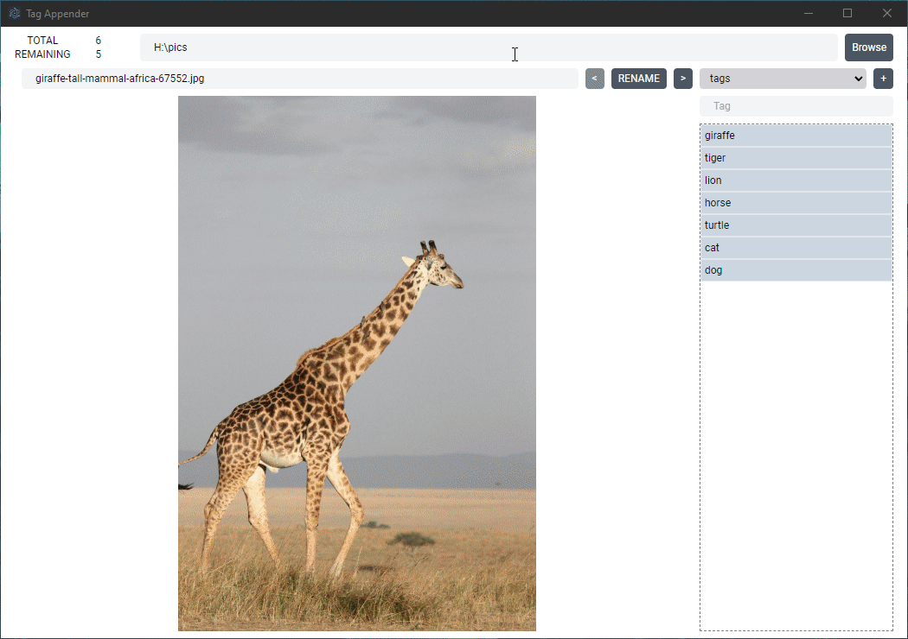
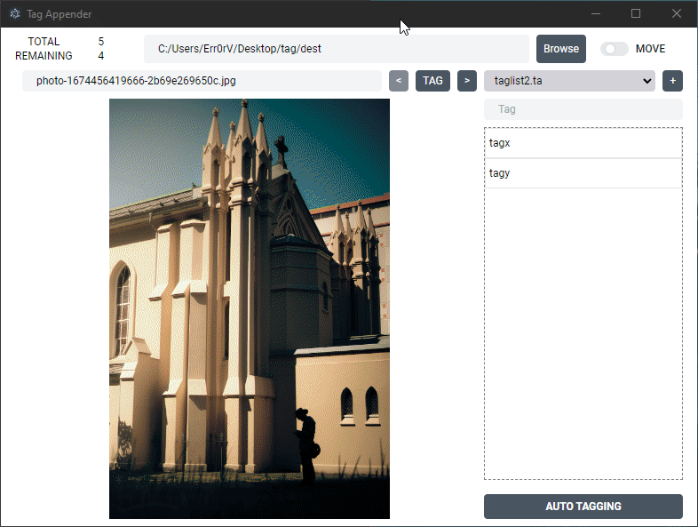

# Tag Appender

  

Tag Appender is a cross-platform application with a user-friendly graphical interface that enables efficient tagging of images. The app allows you to select a directory containing the images you want to tag and then apply one or more tags to each image by appending the tags to the image file name.

## How to Use
### Selecting Tags
- One Tag: To add one tag, just left click the tag from the tag list.
- Multiple Tags: To add multiple tags, hold down the control key while clicking the tags to select them.

### Auto Tagging
To enable automatic tagging for an image, follow these steps:
1. Press Ctrl + left click on the 'Auto Tagging' button.
2. Enter the command to be executed to handle automatic tagging. The app will provide the current image path as the last argument for this command.
3. Click the 'Ok' button.
4. To tag an image automatically, left click the 'Auto Tagging' button on any image. The app will execute the command, reload the tags for the current image if the command is successful, and display an error message if it fails.

  

### Colors
- Blue: denotes a new tag that will be added to the image.
- Green: indicates that the image already have this tag.
- Yellow: refers to tags that the image already have, but are not part of the pre-defined list of tags.

### Config File
To create the config file in the directory where you are currently running the application, include the `--current` flag when running the application.